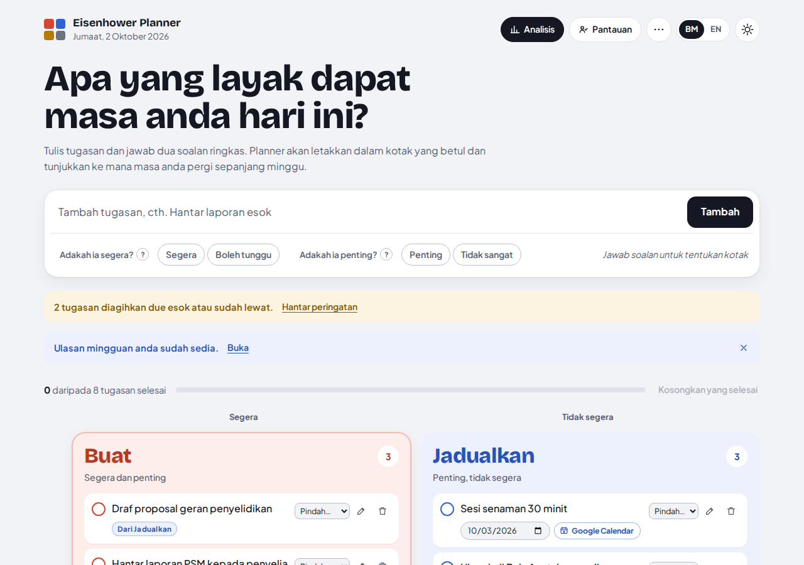
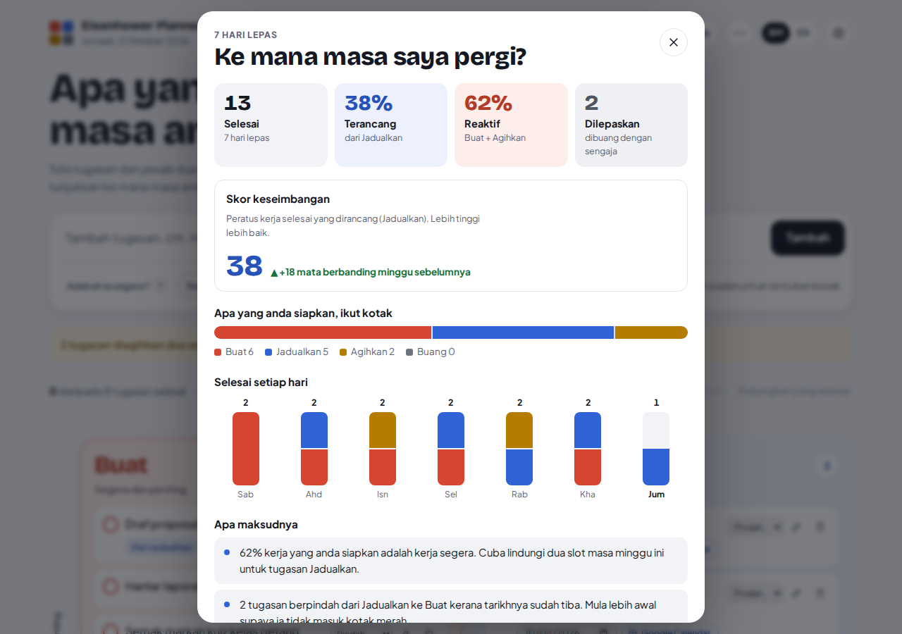
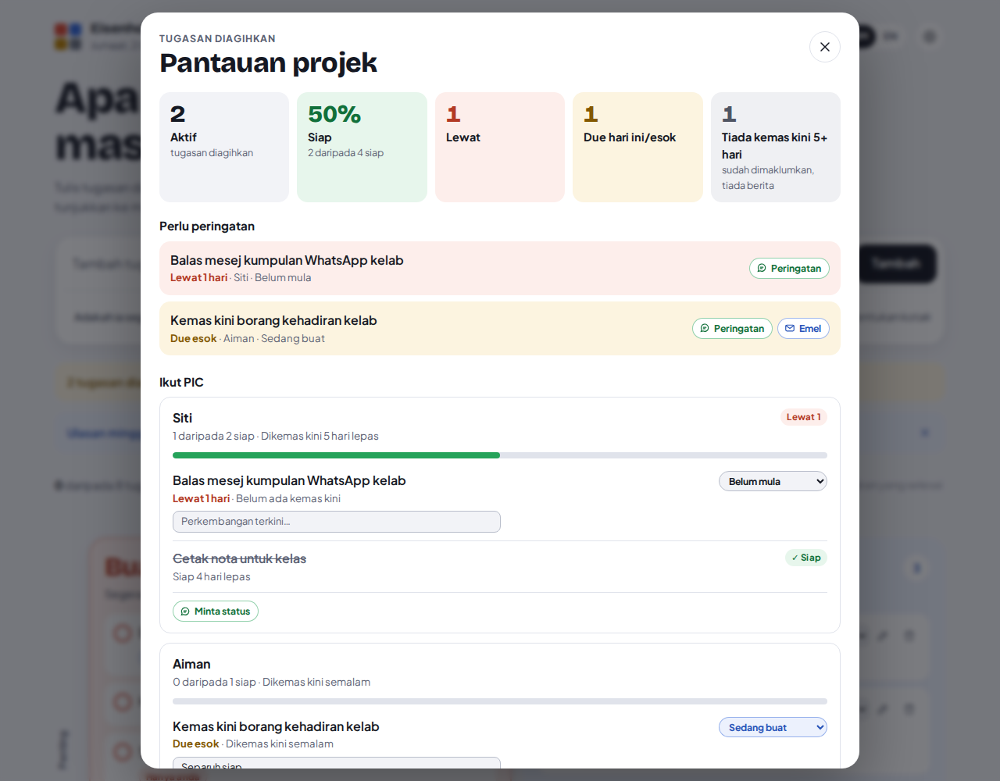

# Eisenhower Planner

**Bukan sekadar senarai, tetapi jurulatih keputusan.**
*Not just a list, a decision coach.*

**Live app:** https://hafizi-ui.github.io/planner/
**Demo with a sample week:** https://hafizi-ui.github.io/planner/?demo=1



## The problem

Students and lecturers spend their week firefighting: assignments due tomorrow, last-minute forms, meetings called at short notice. Work that really matters, like the final-year project, research and lesson preparation, keeps getting pushed back until it becomes a crisis. Ordinary to-do lists record tasks but never question them.

## The idea

The Eisenhower Matrix sorts every task by two questions:

| | Urgent | Not urgent |
|---|---|---|
| **Important** | **Do / Buat**: finish first | **Schedule / Jadualkan**: give it a date |
| **Not important** | **Delegate / Agihkan**: name who handles it | **Delete / Buang**: let it go |

Many apps let you drag tasks into four boxes. This planner goes further. It **helps you decide which box**, then **shows you where your time actually went**.

## What makes it different

1. **Guided triage.** The urgent/important questions start unanswered, so nothing lands in the red box by default. Each question has a short definition (urgent = due within 48 hours or someone is waiting; important = moves a real goal forward). For urgent but unimportant tasks a third question asks *"Can someone else do it?"*.
2. **Deadline words are picked up automatically.** Typing *esok*, *hari ini*, *tomorrow* or *deadline* marks the task urgent and says why.
3. **Tasks move on their own.** When a scheduled task's date arrives, it moves to Do with a "From Schedule" label. This makes the cost of leaving things too late visible.
4. **Weekly Insight: "Ke mana masa saya pergi?"** For the last 7 days it shows what you finished by box, a day-by-day chart, a **Balance score** (share of finished work that was planned) compared with the week before, and plain-language coaching.
5. **Bahasa Melayu and English.** One tap switches every label, hint and insight.
6. **Private and offline.** No account and no server. Data stays on the device. It installs to a phone's home screen and works in flight mode.





## Meetings: assign a task to a PIC in one tap

After a meeting, put each action item in **Delegate**, pick the person in charge (PIC) and set a due date. The task then shows:

- **WhatsApp**: opens WhatsApp with a ready message to the PIC (task, due date and a Google Calendar link)
- **Email**: opens your email app with the subject and message filled in
- **Google Calendar**: creates the event and adds the PIC's email as a guest, so they get an invitation

A "Notified" label shows which PICs have been told.

**Send to each PIC** (button at the bottom of the Delegate box) groups every open task by person and builds **one message per PIC**, numbered and sorted by due date, with an optional heading such as *"Mesyuarat Jabatan Bil. 3/2026"*. Tick *"Only tasks not yet notified"* to send just the new items after a follow-up meeting.

**Team contacts** (⋯ menu) stores each member's name, WhatsApp number and email, so you never retype them. Add them one by one or import a CSV from Excel / Google Sheets (columns: name, WhatsApp no., email). Numbers like `012-345 6789` are converted to WhatsApp format automatically. Contacts stay on your device only and are never part of the public website.

## Project monitor (Pantauan projek)

For whoever follows up on delegated work, such as a head of department or project lead:

- **Status on every delegated task:** Not started / In progress / Needs help / Done, plus a short status note and "last updated" date
- **Reminder banner:** when you open the planner, it tells you how many delegated tasks are due tomorrow or overdue
- **Needs a reminder:** each such task has a one-tap **WhatsApp reminder** (or email) with a polite, ready-written message. A "Reminded today" label prevents double reminders
- **By PIC:** a card per person with a progress bar, overdue and "needs help" flags, and an **Ask for status** button. It sends one message listing that person's open tasks, with reply codes (A = Not started, B = In progress, C = Done, D = Need help), so you can update the status in seconds
- **Summary tiles:** open tasks, % done, overdue, due today/tomorrow, and tasks with no news for 5+ days

The planner has no server, so it cannot send WhatsApp messages on its own. It does the remembering for you and prepares every message, and you tap Send. Google Calendar invitations give PICs their own reminders, based on their calendar notification settings.

## How it works with Google Calendar

Google Calendar answers *when* you are busy. This planner answers *whether that busyness is worth it*. They work together: decide priorities here, then send dated Schedule tasks to Google Calendar with one tap to get reminders and sync across devices. No login or server is needed in the planner for this.

## Who it is for

Diploma and degree students juggling coursework, co-curricular work and part-time jobs, and lecturers balancing teaching, research and administration, starting at KPTM.

## Features

- Add a task and answer two quick questions; the "Goes to" preview shows the box before you add it
- Move tasks by dragging, or with the Move menu (works with a keyboard and on phones)
- Dates for Schedule tasks and due dates for Delegate tasks (overdue dates are flagged)
- **Google Calendar button** on dated Schedule and Delegate tasks: opens Google Calendar with the event already filled in, so the planner decides *what* matters and Calendar handles *when* and reminders
- Double-click or use the pencil to edit; undo after deleting
- Finished and let-go tasks are kept for the weekly Insight (up to 120 days)
- Progress bar (the Delete box is not counted)
- Light and dark theme, BM/EN switch
- Export and import backups (JSON)
- Load a sample week from the ⋯ menu, or open the app with `?demo=1`
- Press `/` to jump to the task box

## Accessibility

- Every action works with a keyboard; focus stays in place after changes
- Moves and additions are announced to screen readers
- Colour contrast meets WCAG 2.2 AA in light and dark themes (checked with axe-core: 0 violations)
- Respects "reduce motion" settings

## Privacy

Everything, including team contacts, is stored in the browser's `localStorage` on your own device. Nothing is sent to any server and there is no tracking. Use **Export backup** to move tasks to another device.

## Tech

Plain HTML, CSS and JavaScript. No frameworks, no build step, no external requests.

```
index.html             page structure
style.css              design and layout
app.js                 all app logic (about 1,100 lines)
sw.js                  offline support
manifest.json          install as an app
icon*.svg, icon*.png   app icons
fonts/                 self-hosted fonts (SIL Open Font License)
docs/                  screenshots
og.png                 preview image for social media links
```

## Publish on GitHub Pages

1. Upload **all** the files and folders above to the repository (Add file → Upload files, drag the whole folder).
2. Go to **Settings → Pages**. Set Source to **Deploy from a branch**, Branch to **main**, folder **/ (root)**, and Save.
3. After a minute the site is live at `https://YOUR-USERNAME.github.io/REPO-NAME/`.
4. When you upload new versions later, change `CACHE` in `sw.js` (for example `planner-v3`) so installed phones pick up the update.

## Run locally

Open `index.html` in a browser. Offline/install features need a web server, for example `python -m http.server`, then open `http://localhost:8000`.

## Roadmap

- Focus mode: one Do task at a time with a 25-minute timer
- Class view for lecturers: an anonymous summary of how a class spends its week
- Reminders for Schedule dates

## Credits

Built by Ahmad Hafizi Bin Ahmad Giran, Kolej Poly-Tech MARA Kuantan.

## License

MIT. See [LICENSE](LICENSE). Fonts: Bricolage Grotesque and Plus Jakarta Sans, SIL Open Font License.
